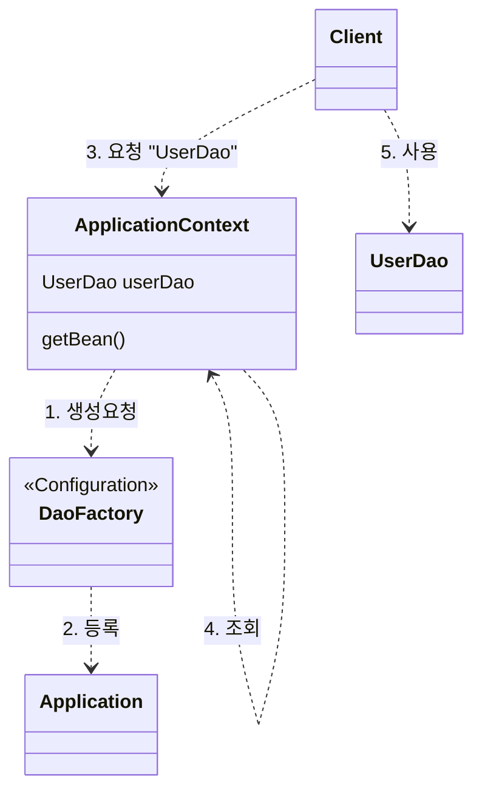

# Application Context의 동작방식

- IoC Container
- 스프링 컨테이너
- 빈 팩토리

애플리케이션 컨텍스트는 `ApplicationContext`라는 인터페이스를 구현한다.
그리고 `ApplicationContext`는 `BeanFactory` 인터페이스를 상속.

## `DaoFactory` 와의 차이

1. `DaoFactory`는 DAO 오브젝트를 생성하고, Dao들과 DB커넥션메이커 오브젝트의 관계를 맺어주는 역할만했다. 
  반면 애플리케이션 컨텍스트는 애플리케이션에서 관리할 **모든 오브젝트**에 대한 생성과 관계설정을 담당한다.
2. `ApplicationContext`에는 직접 오브젝트를 생성하고 관계를 맺어주는 코드가 없다. (작성할 필요 없다)

## 애플리케이션 컨텍스트가 동작하는 방식

## 장점

오브젝트 팩토리로 직접 사용했을때와 비교해서 애플리케이션 컨텍스트를 사용했을 대 얻을 수 있는 장점은 다음과 같다.

- 클라이언트는 구체적인 팩토리 클래스를 알 필요가 없다.
- 종합 IoC 서비스를 제공 : 오브젝트가 만들어지는 방식, 시점과 전략을 다르게 가져갈 수 있다.
- 빈을 검색하는 다양한 방법을 제공: 빈의 이름, 타입, 애노테이션 등으로 찾을 수 있다.