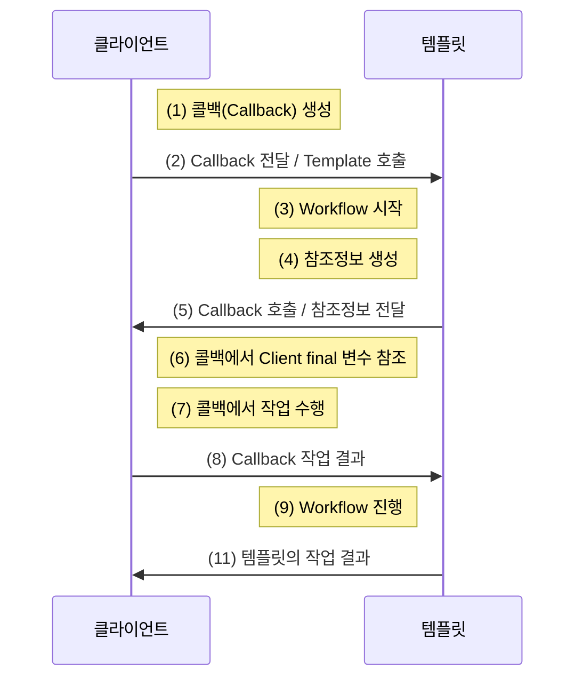

# 템플릿/콜백 패턴

* 템플릿: 템플릿 메소드 페턴은 고정된 틀의 로직을 가진 템플릿 메소드를 슈퍼클래스에 두고, 
  바뀌는 부분을 서브클래스의 메소드에 두는 구조로 이뤄진다.

* 콜백: 실행되는 것을 목적으로 다른 오브젝트의 메소드에 **전달되는 오브젝트**를 말한다.
  파라미터로 전달되지만 값을 참조하기 위함이 아니라 특정 로직의 메서드를 실행하기 위해 사용한다.
  - 자바에서는 메소드 자체를 파라미터로 전달할 방법이 없으므로 메소드가 담긴 오브젝트를 전달한다.

여러 개의 메소드를 일반적인 인터페이스를 사용할 수 있는 전략 패턴의 전략과 달리
템플릿/콜백 패턴의 콜백은 보통 단일 메소드 인터페이스를 사용한다.

## 템플릿/콜백 패턴의 일반적인 작업 흐름

- 콜백을 Strategy로, 템플릿을 Context라고 놓고 보자.
- DI 방식의 전략 패턴 구조라고 생각하고 보면 간단하다.