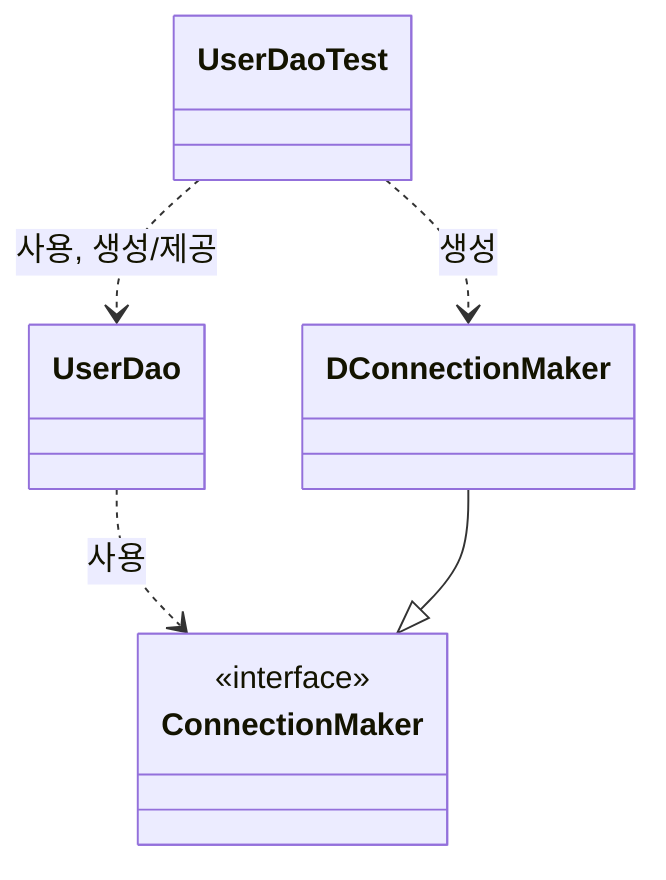

# Open-Closed Principle

클래스나 모듈은 확장에는 열려 있어야 하고 변경에는 닫혀 있어야 한다.

- `UserDao`는 "DB 연결 방법" 이라는 기능을 확장하는 데에는 열려있다!
- 동시에 `UserDao` 자신의 핵심 기능을 구현한 코드는 그런 기능이 어떻게 확장되는가에 영향받지 않고 유지된다.

# High Coherence and Low Coupling

개방 폐쇄 원칙은 `높은 응집도와 낮은 결합도`라는 소프트웨어 개발의 고전적인 원리로도 설명이 가능하다.

## 높은 응집도

- 높은 응집도는 클래스 레벨뿐 아니라, 패키지, 컴포넌트, 모듈에 이르기까지 그 대상의 크기가 달라도 동일한 원리로 적용될 수 있다.

> 변경이 일어날 때 모듈의 많은 부분이 함께 바뀐다면 응집도가 높다고 말할 수 있다.

- 하나의 관심사를 변경하기로 결정 👉🏻 해당 관심사를 다루는 코드가 최대한 모여있어야 한다.

- ex) DB 커넥션에 대한 방법을 변경하기로 하면 👉🏻 DB 커넥션 풀을 활용하는 ConnectionMaker 구현 클래스 하나를 갈아끼우면된다.

## 낮은 결합도

결합도: 하나의 오브젝트에 변경이 일어날 때 관계를 맺고 있는 다른 오브젝트에게 변화를 요구하는 정도

그렇다면 낮은 결합도 원칙은

책임과 관심사가 다른 오브젝트 또는 모듈끼리는 느슨하게 연결된 형태를 유지해야한다는 원칙이다.
관계를 유지하는 데 필요한 **최소한**의 방법만 간접적인 형테로 제공한다. 👉🏻 `interface` 

# UserDao

## 높은 응집도

- `UserDao` 그 자체로 자신의 책임에 대한 응집도가 높다. **사용자의 데이터를 처리**한다 라는 관심사가 흩어져있지 않고 깔끔하게 모여있다.
- `ConnectionMaker` 또한 데이터베이스 커넥션에 대한 책임을 담당한다는 관심사에만 충실하고 있다.

## 낮은 결합도

- `UserDao`와 `ConnectionMaker`의 관계는 인터페이스를 통해 매우 느슨하게 연결 돼있다.
`UserDao`에 `ConnectionMaker` 구현 클래스에 대한 어떤 것도 엉켜 있지 않다. 어떻게 구현하더라도 `UserDao`에는 변화가 요구되지 않는다.

